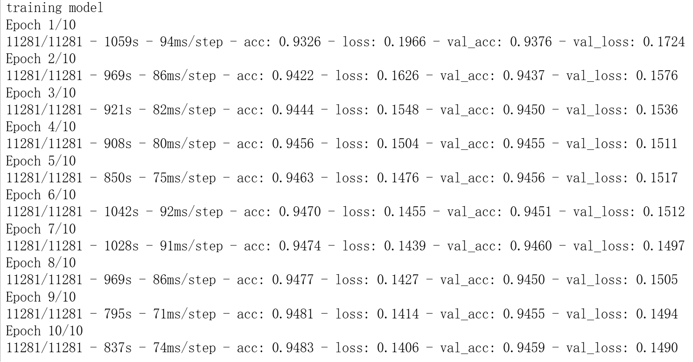
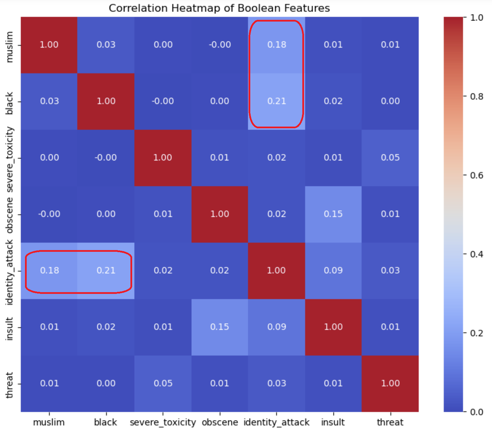
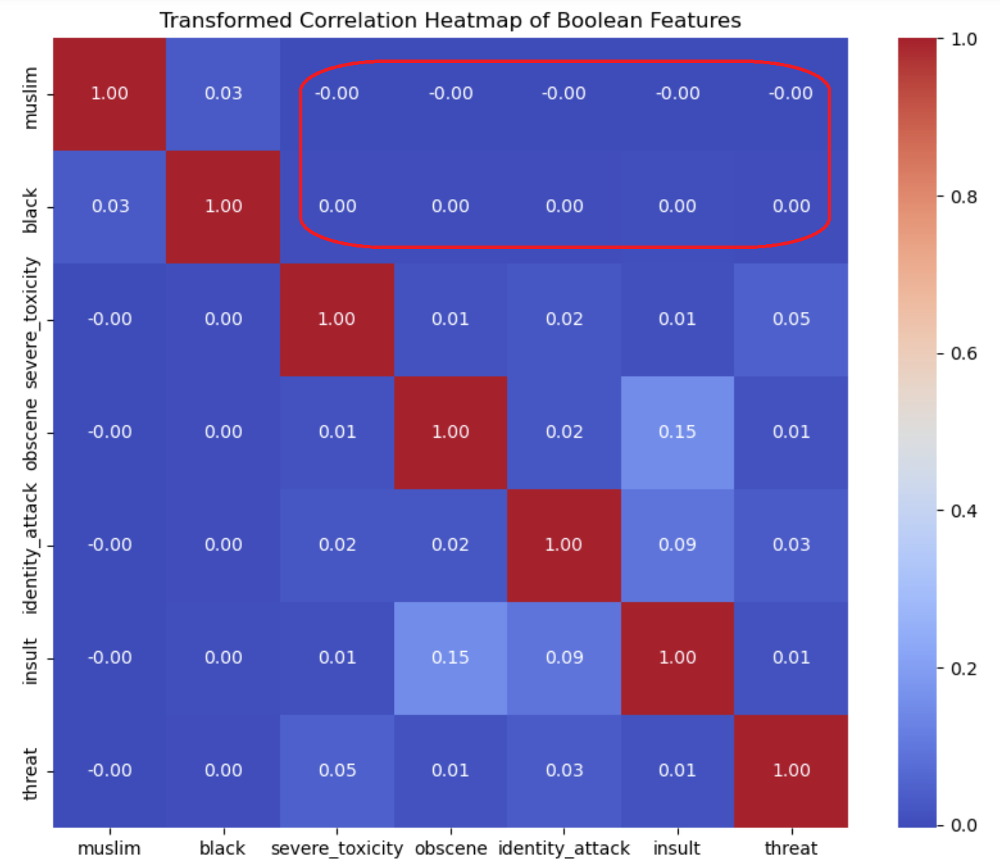

# CS340 Final Project: Depth to Fairness

陈驿来 12013025 黄杭 12010915

## Part One. Run the benchmark model and analyze the result (5 points)

### 1. Train and run the benchmark model to retrieve the prediction result on comment toxicity.

- #### Define and train a Convolutional Neural Net for classifying toxic comments



The main content of this program is a function train_model used to train the model. The functions of this function include preparing data, loading pre-trained word vectors, building models, compiling models, and training models.

In the output, we can see that the model was trained for 10 epochs. The training and validation process of each epoch is recorded, including the accuracy (acc) and loss (loss) of the training set and validation set. During the training process, the accuracy of the training set and the validation set gradually increases, and the loss gradually decreases, which indicates that the performance of the model is continuously improving.

In each epoch, the accuracy and loss for training and validation are shown. These metrics can be used to evaluate model performance and monitor model progress during training.

- #### Define bias metrics, then evaluate our new model for bias using the validation set predictions

  Subsequently, several functions were defined to calculate the performance indicators of the model on different subgroups, including subgroup AUC (subgroup_auc), background positive sample subgroup negative sample AUC (bpsn_auc), and background negative sample subgroup positive sample AUC (bnsp_auc). . These metrics are used to assess how biased the model is towards different subgroups.

  | Metrics                        | Interpretation                                               |
  | ------------------------------ | ------------------------------------------------------------ |
  | compute_auc                    | used to calculate AUC (Area Under the Curve), which is the area under the ROC curve. |
  | compute_subgroup_auc           | Compute the AUC on a specific subgroup.                      |
  | compute_bpsn_auc               | Calculate the AUC between negative samples within the subpopulation and positive samples in the background. |
  | compute_bnsp_auc               | Calculate the AUC between the positive samples within the subpopulation and the background negative samples. |
  | compute_bias_metrics_for_model | Compute the bias metrics of the model on all subgroups.      |

  For the given validation data set and model, the bias index of the model on each subgroup is calculated. The result is as follows:

  | **subgroup**                  | **subgroup_size** | **subgroup_auc** | **bpsn_auc** | **bnsp_auc** |
  | ----------------------------- | ----------------- | ---------------- | ------------ | ------------ |
  | homosexual_gay_or_lesbian     | 2171              | 0.7962           | 0.7738       | 0.9533       |
  | black                         | 2950              | 0.7998           | 0.7677       | 0.9565       |
  | muslim                        | 4246              | 0.8199           | 0.8169       | 0.9458       |
  | white                         | 4937              | 0.8216           | 0.7690       | 0.9616       |
  | jewish                        | 1469              | 0.8419           | 0.8634       | 0.9280       |
  | psychiatric_or_mental_illness | 995               | 0.8724           | 0.8586       | 0.9451       |
  | male                          | 8875              | 0.8752           | 0.8625       | 0.9436       |
  | female                        | 10670             | 0.8803           | 0.8784       | 0.9362       |
  | christian                     | 8092              | 0.8935           | 0.9135       | 0.9165       |

  ##### Interpretation of results:

  ###### Subpopulation AUC: The AUC of the model on a specific subpopulation. This indicator indicates the accuracy of the model in prediction.

  ###### Background positive sample subpopulation negative sample AUC: The AUC of the model between the negative samples within the subpopulation and the positive samples in the background. This indicator indicates the model's prediction accuracy for the positive samples in the background to the negative samples in the subpopulation.

  ###### Background negative sample subpopulation positive sample AUC: The AUC of the model between the positive samples within the subpopulation and the negative samples in the background. This indicator indicates the model's prediction accuracy for the negative samples in the background to the positive samples in the subpopulation.

  It can be seen from the results that the model performs differently on different subgroups. Some subpopulations have lower AUCs, which may mean that the model is biased on these subpopulations. For example, the relatively low AUC for the homosexual_gay_or_lesbian and black subgroups may indicate that the model has lower prediction accuracy on these subgroups. Further analysis and adjustments may need to be conducted for these subgroups.

- #### Summary

  Finally, a comprehensive metric is implemented to evaluate the performance and bias of the model, and the final evaluation metric is calculated. The function first calculates the p-power average of the bias index, weights the overall AUC score and the average bias index, and finally returns the comprehensive evaluation index. By calling the get_final_metric function and passing in the model's bias indicator DataFrame bias_metrics_df and the overall AUC score, the final evaluation metric is obtained, which is **0.8843**. This value represents the overall performance of the model, taking into account the overall AUC and bias. The higher the value, the better the performance of the model. Since the models and processing methods currently used are very basic and biases are not well eliminated, the overall AUC index needs to be improved.

### 2. Value Alignment

Here I randomly selected ten reviews and used the model to judge them [See "benchmark.ipynb" for the code]:

| Comment                                                      | Prediction_score | Predicted_label | My Decision |
| ------------------------------------------------------------ | ---------------- | --------------- | ----------- |
| Dave, I agree the was one of the most entertaining baseball games ever.  I often find baseball boring, especially if I don't have a friend or relative playing.  Game 2 was a great battle going back and forth.  How about an umpire taking a ball to his crotch when a steal at second base was in play! | 0.003540         | 0               | 0           |
| God save the Queen of Canada                                 | 0.016491         | 0               | 0           |
| Sounds like a demonic possession or perhaps alien related to me. Whatever, an "odd,squid-pulsing sensation" on the brain should always be a cause of concern.. | 0.090685         | 0               | 0           |
| Hmm ... over 100 "illegal" dispensaries popped-up in Toronto alone last year, and the Liberal plan is to have 40 outlets up and running across the entire province by July next year.  \n\nAnd they expect to "choke-off" the black market with this kind of supply-demand equation? | 0.033048         | 0               | 0           |
| Thank you for the clarification. What makes the situation so dire now is that it is not just government largess that is offered by elected officials but their generosity (at the federal level) uses vast sums of borrowed money.  Also, at all levels,  elected officials now engage in a sustained effort to choose winners and losers among those who would otherwise be expected to function in a free market economy using innate ability. The classic example of this in Alaska is the Alaska Industrial Development and Export Authority (AIDEA). | 0.033048         | 0               | 0           |
| In answer to the headline - who cares.                       | 0.033048         | 0               | 0           |
| And, IRT PostManx, it's still under ACA or Obamacare.  If the U.S. Senate drag their feet in presenting a healthcare plan, the current costs are going higher because Hawaii born ex-President Obama kicked the Obamacare can into 2017.  Auwe. | 0.002903         | 0               | 0           |
| I'm sure the transgender kid was a plant by Liberal strategists. Pretty pathetic. | 0.973218         | 1               | 1           |
| I don't do polls - you are citing the same pollsters who predicted a Hillary win. Obama had no risk associated with sending a seal team to murder Bin Laden. And Obamacare increase the cost for just about everybody, while deadbeats got it for free, and before you say what about the children, every state I have lived in insures children for free. | 0.002276         | 0               | 0           |
| Well, a few years ago, he was equipped with work boots a hard hat, and air hammer over the community mailbox dustup...so maybe tomorrow he'll be reporting for work somewhere in Quebec. | 0.009896         | 0               | 0           |

The model performance is highly consistent with the manual annotation results, indicating that the model prediction results are consistent with human intuition. By further improving the model, the accuracy of judgment in boundary situations and complex contexts can be improved, making it more reliable in practical applications.

### 3. Model bias assessment using Demographic Parity

 [See "benchmark.ipynb" for the code]

Here we use gender, race, and ethnicity as characteristics for bias assessment:

```
Overall Positive Rate: 0.0690
Subgroup 'male' Positive Rate: 0.1263
Subgroup 'female' Positive Rate: 0.1110
Subgroup 'christian' Positive Rate: 0.0704
Subgroup 'muslim' Positive Rate: 0.1662
Subgroup 'jewish' Positive Rate: 0.1175
Subgroup 'white' Positive Rate: 0.2253
Subgroup 'black' Positive Rate: 0.2327
Disparity difference for 'male': 0.0573
Disparity difference for 'female': 0.0420
Disparity difference for 'christian': 0.0014
Disparity difference for 'muslim': 0.0972
Disparity difference for 'jewish': 0.0484
Disparity difference for 'white': 0.1563
Disparity difference for 'black': 0.1637
Disparity ratio for 'male': 0.5466
Disparity ratio for 'female': 0.6217
Disparity ratio for 'christian': 0.9803
Disparity ratio for 'muslim': 0.4154
Disparity ratio for 'jewish': 0.5877
Disparity ratio for 'white': 0.3064
Disparity ratio for 'black': 0.2967
```

| Synthesis to a Ratio | Attribute | Value  |
| :------------------: | --------- | :----: |
| Smallest Difference  | christian | 0.0014 |
|  Largest Difference  | black     | 0.1637 |
|    Smallest ratio    | black     | 0.2967 |
|    Maximum ratio     | christian | 0.9803 |

- The difference between the **Christian** subgroup and the overall predicted positive proportion is the smallest, only **0.0014**. At the same time, the ratio of the positive predicted proportion to the overall positive predicted proportion is the largest, **0.9803**, indicating that in the Christian subgroup, the model's predictions are almost consistent with the overall prediction, the deviation is minimal.
- The difference between the **black** subgroup and the overall predicted positive class proportion is the largest, **0.1637**. At the same time, the ratio of the positive class prediction proportion to the overall positive class prediction ratio is the smallest, only **0.2967**, indicating that there is a large deviation between the model's prediction and the overall prediction, which requires special attention and improvements.

## Part Two. Mitigate bias from a variety of methods. (15 points)

AI predictions and judgments may exhibit errors and biases for a variety of reasons. Sometimes it's social bias that informs the training data and decisions made when developing and deploying these systems. In other cases, it may not be due to social bias, but to characteristics of the data (e.g., too few data points about certain groups of people) or characteristics of the system itself. These causes can be difficult to distinguish, especially since they are not mutually exclusive and often exacerbate each other. Therefore, we define whether an AI system behaves unfairly in terms of its impact on humans (i.e., harm), rather than in terms of specific reasons (e.g., social bias) or intentions (e.g., prejudice).

#### Identify Groups Who May Be Harmed

In most applications, we consider demographic groups, including historically marginalized groups (e.g., based on gender, race, ethnicity). We should also consider groups relevant to specific use cases or deployment environments. For example, for speech-to-text transcription, this might include groups who speak regional dialects or native or non-native speakers. It’s also important to consider group intersections, for example, in addition to considering groups by gender and groups by race, it’s also important to consider the intersection of them (e.g., Black women, Latinx non-binary people, etc.)
Based on the information provided by Fairlearn API [https://fairlearn.org/v0.10/user_guide/mitigation/], we have made the following Mitigations, below we discuss the various mitigation techniques implemented in Fairlearn such as <u>Preprocessing, Postprocessing, Reductions, Adversarial Mitigation......</u>

#### Preprocessing

Preprocessing algorithms transform the data set to mitigate possible inequities in the data. Preprocessing algorithms in Fairlearn follow the class sklearn.base.TransformerMixin, which means they can fit a preprocessing transform on a dataset (or fit_transform to fit and transform in one go). In this project, because the previous bias analysis of the benchmark found that Muslims and black groups are more likely to be related to the toxicity index, so in the preprocessing part, we focused on the relationship between these two features and the toxicity feature, and manually reduced the correlation.

Sensitive features can be associated with non-sensitive features in the dataset. By applying CorrelationRemover, these correlations are projected away while retaining as much detail as possible in the original data (measured by least squares error). In mathematical terms, let's say we have an original data set that contains a set of sensitive attributes and a set of non-sensitive attributes. The elimination of correlation can be described as:


In the visualization below we can see the relevant values from the original dataset. We are particularly interested in the correlation between the "muslim", "black" columns and the three non-sensitive attributes 'severe_toxicity', 'obscene', 'identity_attack', 'insult', 'threat'. After generating the correlation matrix, we saw that "identity_attack" has a high and abnormal correlation with "muslim" and "black", so our idea is to eliminate this phenomenon through Fairlearn. The code to generate the correlation matrix can be found in the notebook called [Pre-processing.ipynb].



In order to see the effect of CorrelationRemover, we also visualized the changes in the correlation matrix after the data set was transformed. Due to rounding, some 0.0 values appear as -0.0. Either way, CorrelationRemover successfully removes all correlations between "muslim", "black" and other columns, while preserving the correlations between other features.

